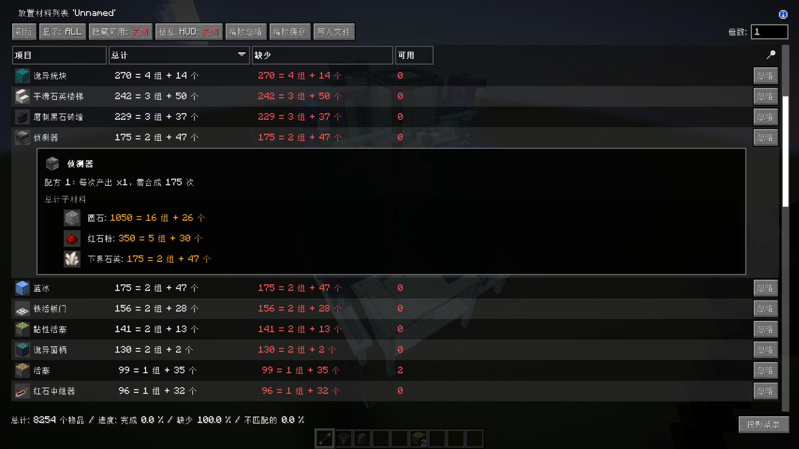
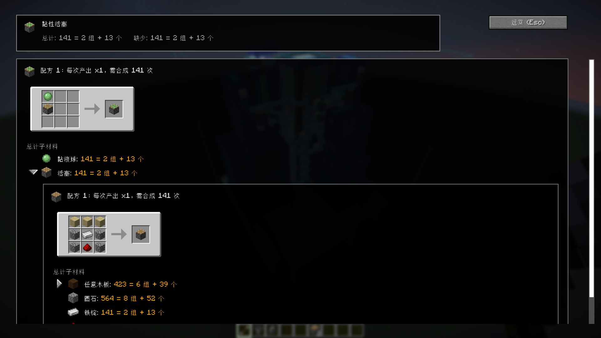

# Litematica Material List Plus

Litematica Material List Plus, 简称 LMLP, 是一个面向 Minecraft Fabric 客户端的 Litematica 材料清单增强模组。

它的目标很简单：让材料清单不只告诉你“缺多少”，还尽量告诉你“这些东西继续往下拆以后，真正需要准备什么”。同时，它尽量保持 Litematica 原本的使用方式和 MaLiLib 风格，不把一个熟悉的工具改得面目全非。

当前发布版本：`v1.2.0`

当前构建：`1.2.12+mc1.20.6`

适配目标：Minecraft `1.20.6` / Fabric / Litematica / MaLiLib / REI

## 预览

> 材料列表单击显示配方摘要 



> 配方详情页  



## 核心功能

### 更易读的材料数量

LMLP 会把材料数量格式化为更适合备料的形式，例如：

```text
493 = 7 组 + 45 个
4437 = 2 盒 + 15 组 + 21 个
```

这样你不用在脑子里反复换算整组、潜影盒和散件数量。

### 材料列表内嵌配方展开

在 Litematica 的材料列表中，单击材料行可以直接展开配方摘要。可合成材料还可以继续向下展开，形成嵌套材料树。

适合这类场景：

- 粘性活塞继续拆成活塞和粘液球
- 活塞继续拆成木板、圆石、铁锭、红石粉
- 切石机、高炉等非工作台配方保留 REI 风格展示

### 配方详情页

`Shift + 单击`材料行可以打开配方详情页。

详情页会尽量复用 REI 的原生配方显示、物品交互和 tooltip。对于同一个材料，如果 REI 返回多个配方来源，详情页会按配方逐项展示。

### 可控制的递归拆分

有些材料不应该继续往下拆。比如红石粉通常应当作为基础材料，而不是继续拆成红石块配方。

LMLP 在配置菜单中提供了：

```text
配方停止拆分物品
```

默认包含：

```text
minecraft:redstone
```

你可以继续添加：

```text
minecraft:iron_ingot
iron_ingot
minecraft:gold_ingot
```

没有命名空间的条目会默认按 `minecraft:` 处理，所以 `iron_ingot` 等同于 `minecraft:iron_ingot`。

### 鼠标悬停浮窗

LMLP 默认启用一个跟随鼠标的材料悬停浮窗。

默认状态只显示核心信息：

```text
物品名
缺少 / 可用
按住指定热键查看详情
```

按住详细浮窗热键后显示：

```text
物品名
总数
缺少
可用
```

浮窗会在靠近屏幕边缘时自动翻转，并限制在屏幕内，尽量避免挡住正在看的内容。

如果你更喜欢 Litematica 原本的材料悬停显示，可以在配置中关闭：

```text
启用 LMLP 悬停浮窗
```

关闭后会恢复 Litematica 原版的悬停效果。

### MaLiLib 风格配置菜单

LMLP 提供和 Litematica 风格一致的配置界面，包含：

- `通用`
- `热键`

你可以通过 ModMenu 打开，也可以使用 LMLP 自己的打开配置热键。

## 默认配置

### 通用

| 配置项 | 默认值 | 说明 |
| --- | --- | --- |
| `启用 LMLP 悬停浮窗` | `true` | 开启 LMLP 的简略/详细鼠标悬停浮窗；关闭后使用 Litematica 原版悬停显示。 |
| `配方停止拆分物品` | `minecraft:redstone` | 列表中的物品会被当作基础材料，不再继续递归拆配方。 |

### 热键

| 热键 | 默认绑定 | 说明 |
| --- | --- | --- |
| `打开配置界面` | `M + =` | 打开 LMLP 配置菜单。 |
| `显示详细浮窗` | `LEFT_ALT` | 悬浮在材料行上时，按住显示详细数量信息。 |

所有热键都可以在 MaLiLib 配置菜单中重新绑定或清空。

## 使用方式

1. 在 Litematica 中打开材料清单。
2. 单击材料行，在列表内展开配方摘要。
3. 单击子材料左侧箭头，继续展开嵌套材料。
4. `Shift + 单击`材料行，打开完整配方详情页。
5. 如果某些材料不应该继续拆，在配置菜单的 `配方停止拆分物品` 中加入物品 ID。

## 安装

1. 从 [Releases](https://github.com/huanmeng06/litematica_material_list_plus/releases) 下载与你的 Minecraft 版本匹配的 jar。
2. 将 jar 放入对应 Fabric 实例的 `mods` 文件夹。
3. 确认同一实例中已经安装 Fabric API、Litematica、MaLiLib 和 REI。
4. 启动游戏，打开 Litematica 材料清单。

## 依赖

当前 `1.2.12+mc1.20.6` 构建面向以下环境：

| 项目 | 版本 |
| --- | --- |
| Minecraft | `1.20.6` |
| Java | `21` |
| Fabric Loader | `>=0.16.9` |
| Fabric API | `0.100.8+1.20.6` |
| Litematica | `0.18.3` |
| MaLiLib | `0.19.2` |
| REI | `15.0.787` |

REI 是必要前置。LMLP 的配方数据、配方详情页和原生配方显示都依赖 REI。

## 本地构建

仓库提供了一个 PowerShell 构建脚本，会基于本地 Minecraft 实例中的 remapped jar 和 mods 目录编译。

基础构建：

```powershell
powershell -ExecutionPolicy Bypass -File .\scripts\build.ps1
```

指定实例目录：

```powershell
powershell -ExecutionPolicy Bypass -File .\scripts\build.ps1 `
  -InstanceDir "D:\path\to\your\instance"
```

构建 Minecraft `1.20.6` 版本时建议指定 Java 21：

```powershell
powershell -ExecutionPolicy Bypass -File .\scripts\build.ps1 `
  -InstanceDir "D:\path\to\your\1.20.6-instance" `
  -JavaHome "C:\path\to\jdk-21" `
  -JavaRelease 21
```

构建产物会输出到：

```text
build\libs\
```

## 版本说明

### v1.2.12

- 新增中文（香港繁體）语言文件。
- 优化英文语言文件中的配置菜单、tooltip 和配方详情页文案。

### v1.2.11

- 将数量格式中的“盒 / 组 / 个”等显示文本移动到语言 JSON，方便多语言翻译。
- 修复配方详情页标题未按语言文件翻译的问题。

### v1.2.10

- 移动物品按钮 tooltip 中的配方 ID 行改为 REI 风格灰色显示。

### v1.2.9

- 修复移动物品按钮 tooltip 中配方 ID 显示异常的问题，改为使用 LMLP 自己的本地化文本显示完整配方 ID。
- 加强收藏提示过滤，避免 REI 收藏说明混入移动物品按钮 tooltip。

### v1.2.8

- 修复移动物品按钮 tooltip 渲染 REI 自定义组件时触发 `Unknown TooltipComponent` 崩溃的问题。
- 转移按钮 tooltip 现在只渲染文本内容，避免非 REI 原生页面直接交给 Minecraft 渲染未知组件。

### v1.2.7

- 修复 LMLP 配方详情页中移动物品按钮悬停时不显示 REI 转移提示的问题。
- 过滤移动物品按钮 tooltip 中的 REI 收藏提示行，保留移动、缺少材料、容器不匹配和配方 ID 等关键信息。

### v1.2.6

- 配方详情页的移动物品按钮改为使用 REI 默认的 10x10 加号区域，并按 REI 的默认位置贴在配方面板右下角外侧。
- 移动按钮的可用、缺少原料、容器不匹配和悬停提示改为复用 REI `TransferHandler.Result` 逻辑。

### v1.2.5

- 配方详情页的物品转移按钮改为使用 REI 原生按钮组件，按钮样式、悬停效果和提示文本跟随 REI。
- 按钮位置调整到配方面板右下角，继续复用 REI 的转移处理逻辑，把当前加工界面作为目标容器。

### v1.2.4

- 在配方详情页的 REI 配方面板中新增移动物品按钮；从工作台等加工界面打开材料列表再进入详情页时，可尝试调用 REI 将材料摆入当前加工台。
- 点击按钮后若 REI 转移成功，会返回原加工界面以便直接查看摆放结果。

### v1.2.3

- 修复 `1.2.2` 在启动阶段因容器界面 Mixin 注入目标不存在而崩溃的问题。
- 容器内打开材料列表改为真正打开 Litematica 原生 `GuiMaterialList`，并仅跳过这一次切屏导致的容器关闭；Esc 返回后保留原工作台等加工界面。

### v1.2.2

- 将加工容器中的材料列表入口改为叠层显示，关闭材料列表时不再一并关闭工作台、高炉、切石机等原加工界面。
- 叠层继续复用 Litematica 原生材料列表控件，保留排序、搜索、滚动和 LMLP 行内配方展开。

### v1.2.1

- 修复在工作台、高炉、切石机等加工容器界面中，Litematica 材料列表热键无法打开材料列表的问题。
- 该入口直接打开 Litematica 原生材料列表，LMLP 的材料展开和配方详情功能会继续生效。

### v1.2.0

- 新增嵌套材料拆分。
- 新增配方停止拆分列表。
- 新增 Litematica 风格 MaLiLib 配置菜单。
- 新增可配置详细悬停浮窗热键。
- 新增打开 LMLP 配置菜单热键。
- 新增 LMLP 悬停浮窗总开关，可恢复 Litematica 原版悬停显示。
- 优化配置页行间距和分类布局。
- 优化材料悬停浮窗，支持边缘翻转、屏幕内限制和文本截断。

## 许可证

本项目使用 MIT License 发布。

Litematica、MaLiLib、REI、Fabric API 等依赖模组遵循其各自许可证。本项目不随 jar 打包这些依赖。
